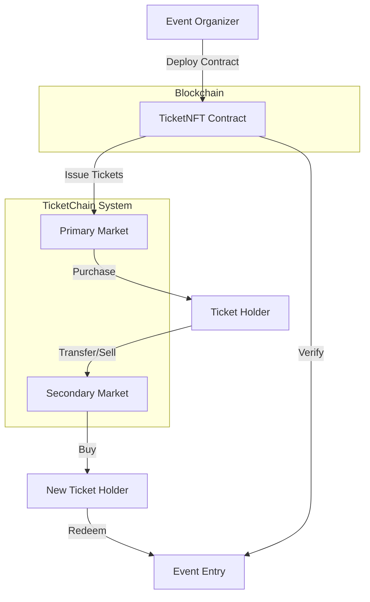

# TicketChain 🎟️

[](https://opensource.org/licenses/MIT)
[](https://soliditylang.org/)
[](https://github.com/yourusername/ticketchain)

A blockchain-based NFT ticketing system built on Ethereum.

## Table of Contents

- [Overview](#overview)
- [Architecture Diagram](#architecture-diagram)
- [Tech Stack](#tech-stack)
- [Quick Start](#quick-start)
- [Detailed Setup](#detailed-setup)
- [Usage Examples](#usage-examples)
- [Testing](#testing)
- [Deployment](#deployment)
- [Configuration Reference](#configuration-reference)
- [Contributing Guide](#contributing-guide)
- [Roadmap & Planned Features](#roadmap--planned-features)
- [Known Issues / Limitations](#known-issues--limitations)
- [License](#license)
- [Acknowledgments & References](#acknowledgments--references)
- [Contact & Community](#contact--community)

## Overview

TicketChain revolutionizes event ticketing by providing a secure, transparent, and decentralized platform powered by blockchain technology. Each ticket is represented as a unique NFT (Non-Fungible Token) on the Ethereum blockchain, ensuring authenticity and eliminating counterfeiting.

### Key Features:

- **Secure Ticket Issuance** - Create tamper-proof digital tickets with customizable metadata
- **Verified Resale Market** - Control secondary market transfers with royalty schemes
- **Time-Based Validity** - Built-in mechanisms for ticket validation timeframes
- **Access Control** - Granular permission system for event organizers
- **Transparent Ownership** - Clear history of ticket ownership and transfers
- **Anti-Scalping Measures** - Price caps and transfer limitations

## Architecture Diagram



## Tech Stack

- **Solidity (v0.8.20)** - Smart contract language offering security features and EVM compatibility essential for ticket NFT implementation.
- **OpenZeppelin Contracts** - Provides security-audited contract implementations for access control, tokens, and pausability to reduce vulnerability risks.
- **Hardhat** - Ethereum development environment with debugging, network management, and testing tools that streamline the development workflow.
- **Ethers.js** - JavaScript library for interacting with the Ethereum blockchain, chosen for its comprehensive API and Promise-based interface.
- **Chai/Mocha** - Testing frameworks that enable robust contract testing with readable assertions and organized test suites.

## Quick Start

Get TicketChain running locally in minutes:

```bash
# Clone the repository
git clone https://github.com/yourusername/ticketchain.git
cd ticketchain

# Install dependencies
npm install

# Start a local Ethereum node
npx hardhat node

# Deploy contracts to the local network (in a new terminal)
npx hardhat run scripts/deploy.js --network localhost

# Mint a test ticket
npx hardhat run scripts/mint-tickets.js --network localhost
```

### Docker Quick Start

```bash
# Build and run with Docker
docker build -t ticketchain .
docker run -p 8545:8545 ticketchain
```

## Detailed Setup

### Prerequisites

- Node.js >= 16.x
- npm >= 8.x
- Git

### Environment Configuration

Create a `.env` file in the project root based on the provided `.env.example`:

```
# File: .env
INFURA_API_KEY=your_infura_api_key
PRIVATE_KEY=your_wallet_private_key
ETHERSCAN_API_KEY=your_etherscan_api_key
CONTRACT_ADDRESS=0x123...  # Only needed for script execution
```

### Network Configuration

TicketChain supports multiple Ethereum networks. Default configuration is in `hardhat.config.js`:

```js
// File: hardhat.config.js
module.exports = {
  solidity: {
    version: "0.8.20",
    settings: {
      optimizer: {
        enabled: true,
        runs: 200
      }
    }
  },
  networks: {
    // Local development
    hardhat: {
      chainId: 31337
    },
    // Local node
    localhost: {
      url: "http://127.0.0.1:8545",
      chainId: 31337
    },
    // Sepolia testnet
    sepolia: {
      url: `https://sepolia.infura.io/v3/${process.env.INFURA_API_KEY}`,
      accounts: [PRIVATE_KEY],
      chainId: 11155111,
      gas: 2100000,
      gasPrice: 8000000000 // 8 gwei
    }
  }
}
```

### Contract Compilation

```bash
npx hardhat compile
```

## Usage Examples

### Example 1: Deploy the Ticketing Contract

```bash
# Deploy to local development network
npx hardhat run scripts/deploy.js --network localhost

# Deploy to Sepolia testnet
npx hardhat run scripts/deploy.js --network sepolia
```

**Expected Result:** Contract address displayed in terminal and saved to `deployments/{network}-deployment.json`

### Example 2: Mint a New Ticket

```bash
# Create a basic ticket with default parameters
npx hardhat run scripts/mint-tickets.js --network localhost
```

**Expected Result:** Ticket #1 minted with specified metadata (event ID, price, validity period, etc.)

### Example 3: Transfer a Ticket

```js
// File: scripts/transfer-ticket.js
const ticketId = 1;
const recipientAddress = "0xRecipientAddressHere";
const tx = await ticketNFT.connect(ticketOwner)["safeTransferFrom(address,address,uint256)"](
  ticketOwner.address,
  recipientAddress,
  ticketId
);
await tx.wait();
```

**Expected Result:** Ticket ownership transferred to recipient (transaction hash displayed)

## Testing

TicketChain includes comprehensive tests for all core functionality.

### Running the Test Suite

```bash
# Run all tests
npx hardhat test

# Run specific test file
npx hardhat test test/TicketLifecycle.test.ts

# Run tests with gas reporting
REPORT_GAS=true npx hardhat test

# Run test coverage analysis
npx hardhat coverage
```

### Test Structure

- `test/AccessControl.test.ts` - Tests for role-based permissions
- `test/SecurityAndPausability.test.ts` - Tests for pausing functionality
- `test/TicketLifecycle.test.ts` - Tests for ticket creation, validation, and transfer

## Deployment

### Production Deployment

For production deployments, follow these steps:

1. Configure `.env` with your production credentials
2. Run the deployment script targeting your production network:

```bash
npx hardhat run scripts/deploy.js --network mainnet
```

### Contract Verification

To verify your contract on Etherscan:

```bash
npx hardhat verify --network sepolia YOUR_DEPLOYED_CONTRACT_ADDRESS
```

### CI/CD Integration

TicketChain can be integrated with GitHub Actions or other CI providers. Example workflow:

```yaml
# File: .github/workflows/main.yml
name: TicketChain CI
on: [push, pull_request]
jobs:
  test:
    runs-on: ubuntu-latest
    steps:
      - uses: actions/checkout@v3
      - uses: actions/setup-node@v3
        with:
          node-version: 16
      - run: npm ci
      - run: npm test
```

## Configuration Reference

| Parameter | Default | Description | Where to Set |
|-----------|---------|-------------|-------------|
| `MINTER_ROLE` | Owner | Controls who can create new tickets | Contract, grantRole function |
| `PAUSER_ROLE` | Owner | Controls who can pause/unpause the contract | Contract, grantRole function |
| `Gas Limit` | 2,100,000 | Maximum computational effort for transactions | hardhat.config.js |
| `Gas Price` | 8 gwei | Price per unit of gas (network-specific) | hardhat.config.js |
| `Optimizer Runs` | 200 | Contract optimization level | hardhat.config.js |
| `Network Chain ID` | 31337 (localhost) | Blockchain network identifier | hardhat.config.js |

## Contributing Guide

We welcome contributions from the community! Follow these steps to contribute:

### Branching Model

- `main` - Production-ready code
- `develop` - Latest development changes
- `feature/*` - New features
- `bugfix/*` - Bug fixes

### Development Workflow

1. Fork the repository
2. Create a feature branch (`git checkout -b feature/amazing-feature`)
3. Make your changes
4. Run tests (`npx hardhat test`)
5. Commit your changes (`git commit -m 'Add some amazing feature'`)
6. Push to the branch (`git push origin feature/amazing-feature`)
7. Open a Pull Request

### PR Checklist

- [ ] Tests added/updated for new functionality
- [ ] Documentation updated
- [ ] Code follows project style guide
- [ ] All tests passing

## Roadmap & Planned Features

- **Q2 2025**: Mobile app integration
- **Q3 2025**: Multi-chain support (Polygon, Optimism)
- **Q3 2025**: Advanced ticketing features (e.g., seat selection, tiered pricing)
- **Q4 2025**: Event organizer dashboard
- **Q1 2026**: Integration with point-of-sale systems
- **Future**: Layer 2 scaling solution integration

## Known Issues / Limitations

- **Gas Costs**: High gas prices on Ethereum mainnet can make individual ticket minting expensive
  - *Workaround*: Use batched minting or consider L2 solutions
- **Block Confirmation Times**: Event entry might require waiting for transaction confirmations
  - *Workaround*: Use state channels or implement a centralized verification layer
- **MetaMask Required**: Requires users to have MetaMask or similar wallet
  - *Workaround*: Implement custodial solution for mainstream adoption
- **Ethereum Node.js v23 Compatibility**: Some warnings appear with newer Node.js versions
  - *Workaround*: Use Node.js v18 for best compatibility

## License

This project is licensed under the MIT License - see the [LICENSE](LICENSE) file for details.

```
MIT License

Copyright (c) 2025 TicketChain Contributors

Permission is hereby granted, free of charge, to any person obtaining a copy
of this software and associated documentation files...
```

## Acknowledgments & References

- OpenZeppelin for their secure contract implementations
- Ethereum Foundation documentation
- [ERC-721 Non-Fungible Token Standard](https://eips.ethereum.org/EIPS/eip-721)
- [NFT Ticketing Research Paper](https://arxiv.org/abs/example)
- Inspired by [GET Protocol](https://get-protocol.io/) and other blockchain ticketing projects

## Contact & Community

- **GitHub Issues**: For bug reports and feature requests
- **Email**: team@ticketchain.example.com
- **Discord**: [Join our server](https://discord.gg/ticketchain)
- **Twitter**: [@TicketChainDev](https://twitter.com/ticketchaindev)